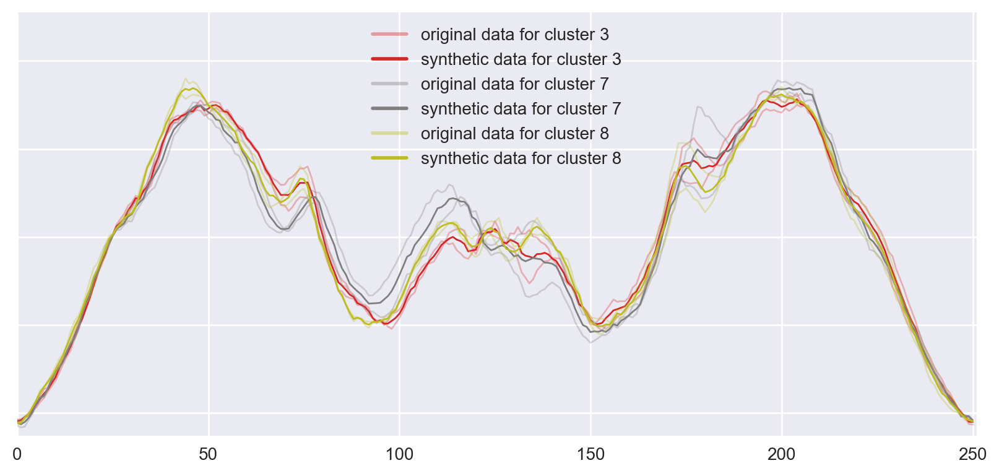

## Introduction
A time-series data point is series of measurements which have been gathered periodically over time, often with equal intervals. Classifying time-series data for signal processing and pattern recognition on portable devices is desirable in many applications. Since pre-trained simple artificial neural networks are very fast at prediction, they can be utilized for these applications. One bottleneck for this approach is that ANNs require large datasets to train on to not overfit. This project explores a way to generate synthetic time-series data from existing datasets to help neural networks not overfit on small datasets.

First, we will modify the *k-means algorithm* in Method to generate synthetic time-series data from an existing dataset. In Evaluation, we will compare prediction performance of a simple Multi-Layer-Perceptron model trained with the original dataset, the original dataset together with synthetically generated data-points and a bigger authentic dataset acquired through re-splitting the training and test data sets.

## Method
K-means is a popular clustering algorithm. After initializing with k random centroids, the algorithm works loops through two steps: 1) Assignment step assigns every data point to the _closest_ centroid according to a selected metric. 2) Expectation step moves centroids to be in the _center_ of the assigned data-points, again according to a selected metric.

We need some adjustments, most notibly: a similarity metric for time-series and a method for calculating time-series sample mean.

1. Initialise centroids with k random data-points
2. Use _dynamic time warping_(DTW) as the distance metric to assign data points to centroids. DTW is a similarity metric for time-series. We use fastdtw[^1]
3. As a sample mean to calculate new centroids, use the Schultz’ and Jain’s stochastic subgradient mean algorithm [^2]
4. Remove clusters with only one data-point assignment because they are identical to this data-point
5. Repeat step 2 to 4 for n iterations


*Figure 1: Example of 3 new clusters generated for one class in ArrowHead*

Pseudo-code for the whole algorithm is below, you can find the code in the [repo](https://github.com/oguzserbetci/generate-time-series).

```python
for rep in n_reps:
    for class in classes:
        for i in k:
            clusters ← pick n random data-points from class;
            allocate each data point to the nearest cluster using DTW;

            for cluster in clusters:
                cluster ← SSG(data points allocated to the cluster, ssg_epochs);
```

There are 4 parameters: `n_reps`, `k`, `n`, `ssg_epochs` for this algorithm. We set `n` using `n_base` argument `n = ceil(N/n_base)`, meaning we generate a cluster for every `n_base` data-points.


*Figure 2: Example of 3 new data points generated for ArrowHead data*

## Experiments
We picked sample datasets from the UCR Time Series Classification Archive[^3] to assess the performance of our approach. Selected datasets are distributed on the scale of 1-NN Best Warping Window DTW. See _Table 1_ for more detail on selected datasets.

| Name | Size of training/test set | Number of classes | Time series length | 1-NN Best Warping Window DTW ( _r_ ) |
|:--|:--|:--|:--|:--|
| ArrowHead | 36/175 | 3 | 251 | 0.2 |
| Wine | 57/54 | 2 | 234 | 0.389 |
| Adiac | 390/391 | 37 | 176 | 0.391 |
| InlineSkate | 100/550 | 7 | 1882 | 0.613 |

> Table 1: Datasets compared in our experiments

### Data preparation
We create 3 datasets to compare performance on:
_EXP_: Original dataset together with synthetic data-points generated from it is referred with EXP label (abbreviation for expanded). We expand based on the original dataset and merge them before training. We use `k=1`, `n_reps=10`, `n_base=2`, `ssg_epochs=None` – which means SSG algorithm sets it.

_ALT_: We have re-split the training and test data to show the performance gain in case we could collect more data. In our experiments, we split the data to 70% training, 30% test. Resulting sets are labeled with ALT (abbreviation for alternative)

_ORG_: The untouched training sets are labeled with ORG (abbreviation for original)

See Figure 2 above and Figure 7, 8, 9, 10, 11 in appendix for visualisations of the data.

### Model
Because selected data sets are very small in size, reliable model validation is not feasible. Model parameters are selected without validation and prior-knowledge, accordingly, they are only illustrative. Our simple Multi-Layer-Perceptron architecture is as follows: 2 hidden layers with 50 and 30 neurons with rectifier activation and 0.1 dropout.

### Evaluations
All results are averaged over 10 separate training with 150 epochs.

#### Wine
Expanded Wine data is where the results look most promising in our experiments. It is evident the generated data points help the MLP generalize better, and even perform better than additional authentic data.


*Figure 3: Performance of the MLP on Wine data (smoothed over 10 epochs)*

#### Adiac
Expanding Adiac data performs also better than additional authentic data.


*Figure 4: Performance of the MLP on Adiac data*

#### InlineSkate
Not all data sets we have worked with improved performance. Expanded InlineSkate data has had minimal improvement if any. As it is seen in Figure 4, the alternative data set has far outperformed the expanded dataset.


*Figure 5: Performance of the MLP on InlineSkate data*

#### ArrowHead
Performance on this data set is similar to the InlineSkate, better start but same performance in the end.


*Figure 6: Performance of the MLP on ArrowHead data*

| Name | Size of training/test set | 1-NN Best Warping Window DTW ( _r_ ) | MLP Performance
|:--|:--|:--|:--|
| _ArrowHead_ |
          ORG | 36/175   | 0.200 |  0.228 |
          EXP | 3620/175 |       |  0.223 |
          ALT | 147/64   |       |  0.107 |
| _Wine_ |        |       |       |
     ORG | 57/54  | 0.389 | 0.474 |
     EXP | 517/54 |       | 0.372 |
     ALT | 77/34  |       | 0.420 |
| _Adiac_ |          |       |        |
      ORG | 390/391  | 0.391 |  0.553 |
      EXP | 4012/391 |       |  0.348 |
      ALT | 544/235  |       |  0.466 |
| _InlineSkate_ |          |       |       |
            ORG | 100/550  | 0.613 | 0.675 |
            EXP | 1260/550 |       | 0.661 |
            ALT | 454/196  |       | 0.564 |

> Table 2: Size of generated data sets and MLPs performance

## Conclusion
Artificially generating data-points does not warrant a performance increase for all datasets. But for some data, it has substantial benefit despite the simple model we have used. Furthermore, there are many parameters that can be tuned to possibly reach higher accuracy.

1. Number of iterations for the k-means algorithm (`n_reps`). We have used 1 iteration.
2. Number of iterations for the SSG mean, we haven’t set this parameter (`ssg_epochs`).
3. Number of bases, we set this as 2 (`n_base`).

- - -

## APPENDIX
### SAMPLES FROM DATASETS


*Figure 7: Examples of classes from the original Wine data set*


*Figure 8: Examples of classes from the original Adiac data set*


*Figure 9: Examples of classes from the original InlineSkate data set*

### SYNTHETIC DATA-POINTS


*Figure 10: Examples of data-points generated for classes from original InlineSkate data set*


*Figure 11: Examples of data-points generated for classes from original Adiac data set*

[^1]: [fastdtw](https://pypi.python.org/pypi/fastdtw)

[^2]: D. Schultz and B. Jain, “Nonsmooth Analysis and Subgradient Methods for Averaging in Dynamic Time Warping Spaces,” arXiv Prepr. [arXiv1701.06393](https://arxiv.org/abs/1701.06393), 2017.

[^3]: [UCR Time Series Classification Archive](http://www.cs.ucr.edu/~eamonn/time_series_data/)
