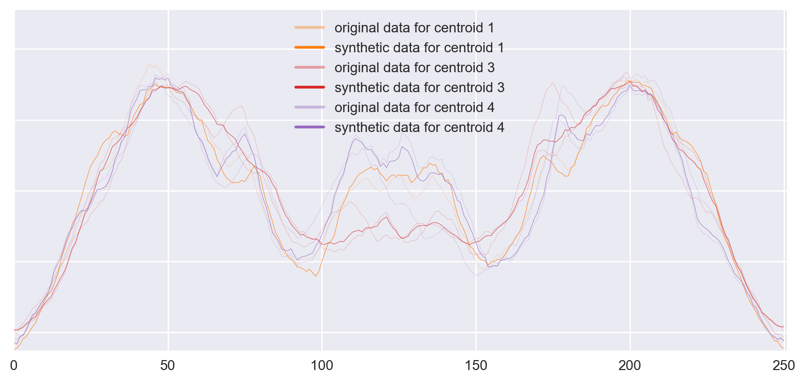
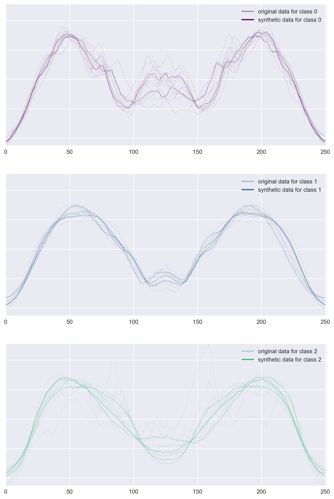
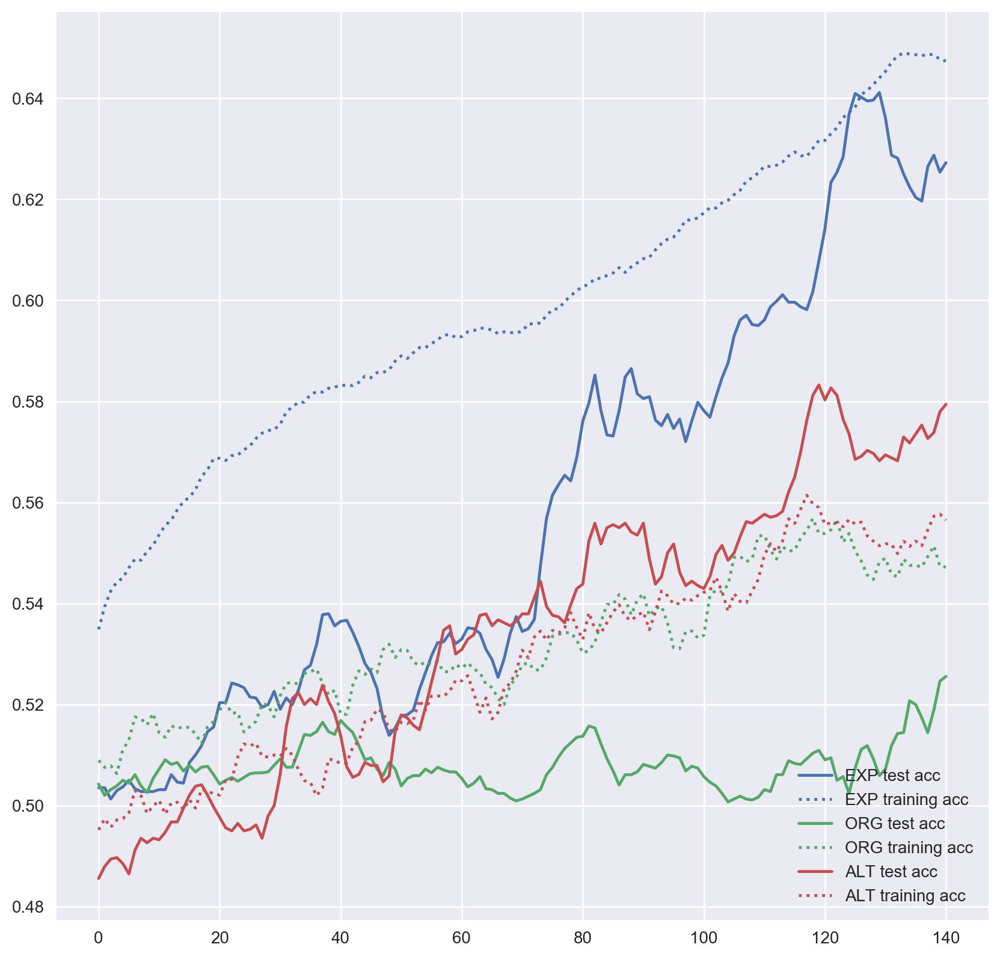
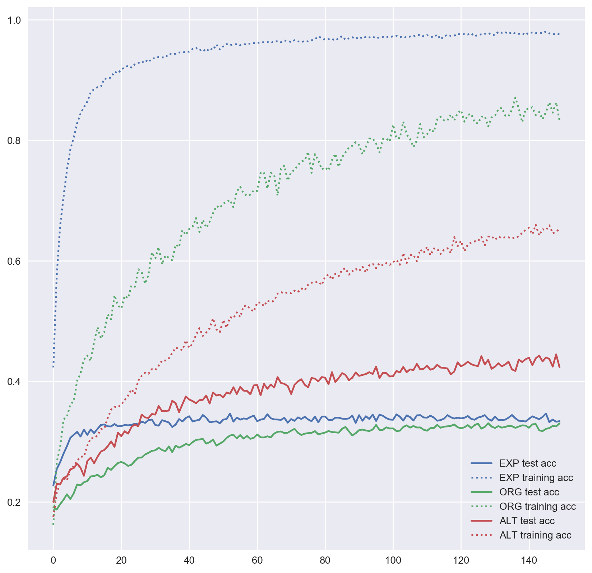
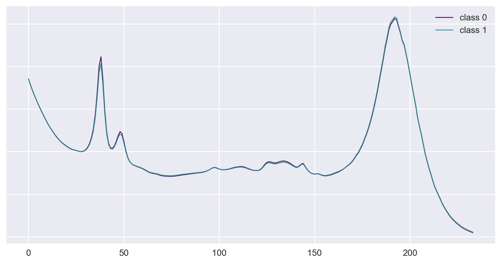
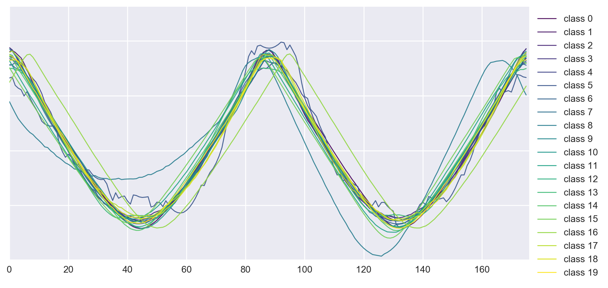
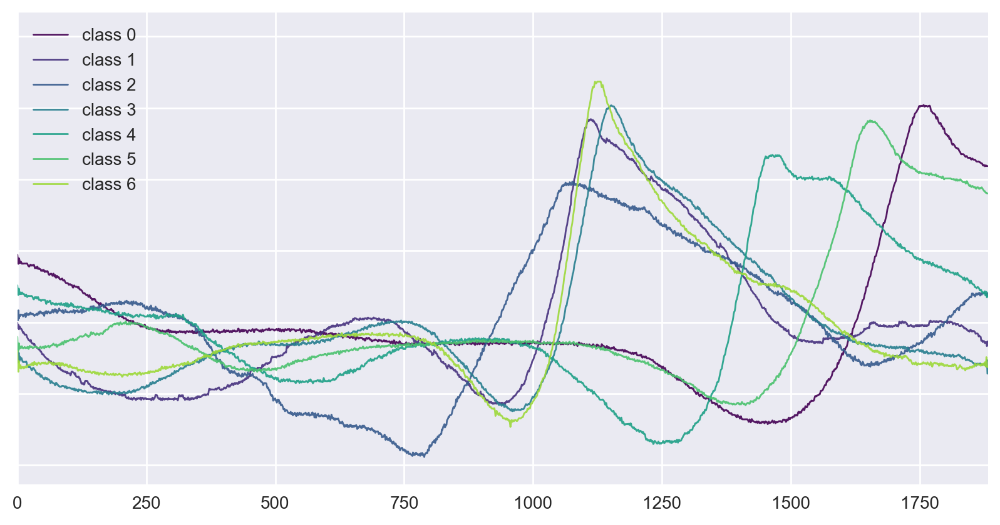
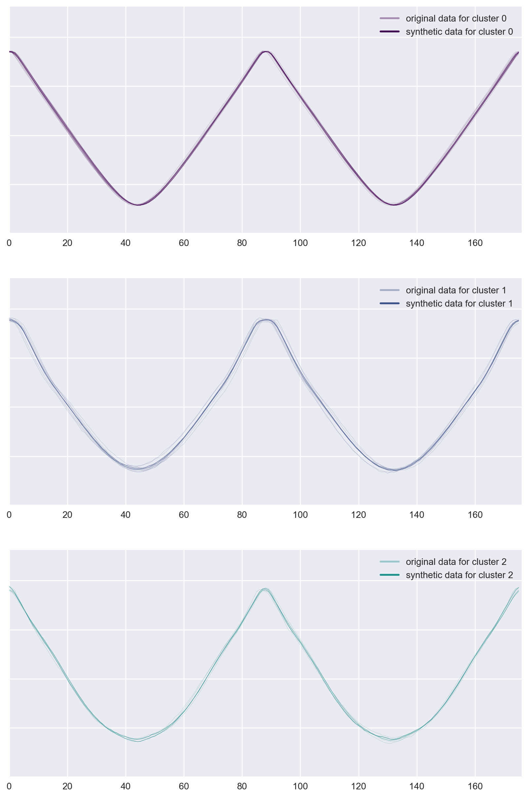

# Synthetic time series generation for training simple multi-layer-perceptron classifier
A time series data is a series of measurements which have been gathered periodically over time, often with equal intervals.
Examples of time series include phoneme recordings, hand gestures, temperature and electricity usage over time.
Thus, classifying time series data on portable devices for signal processing and pattern recognition is important in many applications.
Pre-trained simple artificial neural networks can be utilized for fast prediction with low computation cost.
One bottleneck for this approach is that ANNs require large datasets to train on to not overfit and have a good accuracy performance.
This project explores a way to generate synthetic time series data from an existing dataset to help neural networks not overfit on small datasets.

First, we will modify the *k-means algorithm* to generate synthetic time series data from an existing dataset.
In Evaluation, we will compare prediction performance of a simple Multi-Layer-Perceptron model trained with the original dataset, the original dataset together with synthetically generated data and a bigger authentic dataset acquired through re-splitting the training and test sets.

## Method
We want to generate new time series data for each class in the original data which carry its characteristics.
To achieve this, we will modify the k-means clustering algorithm.
After initializing with _n_ random centroids, the algorithm normally loops following steps _k_ times:
1) Assignment step assigns every data to the _closest_ centroid according to a selected distance measure.
2) Expectation step moves centroids to be in the _center_ of the assigned data, again according to a selected distance measure.

Resulting centroids are typically used for clustering.
Instead, we run the k-means algorithm for each class in dataset separately and use the resulting centroids as new data for respective class.
Other adjustments we do are: using a distance measure for time series and a method for calculating mean of time series samples.
Outline of the procedure is as follows:

1. Initialise centroids with _n_ random data.
2. Use _dynamic time warping_ (DTW) as the distance measure to assign data to centroids. DTW is a distance measure for time series. We use the fastdtw[^1] implementation for python.
3. Remove centroids with only one assignment as mean of one assignment will not create a new data.
4. As a sample mean to calculate new centroids, use the Schultz and Jain’s stochastic subgradient mean algorithm [^2] (SSG).
5. Repeat step 2 to 4 for k iterations.


*Figure 1: Example of 3 new centroids generated for a class in ArrowHead. Second centroid is dropped because of step 3.*

The algorithm has 4 parameters: `k` is the number of k-means iterations, `ssg_epochs` is the number of iterations for SSG algorithm, `n_base` controls the number of centroids to be generated (=_n_), intuitively algorithm generates one centroid for every `n_base` data.
Pseudo-code for the whole algorithm is below, you can find the code in the [repo](https://github.com/oguzserbetci/generate-time-series).

```
func spawn(data, k, n_base, ssg_epochs):
    new_data = [ ]

    for c in classes:
        c_data ← data with class c
        n ← ceil(|c_data| / n_base)
        repeat k times:
            centroids ← pick n random data from c_data
            allocate each data from c_data to the nearest centroid using DTW

            for centroid in centroids:
                centroid ← SSG(subset of c_data which is allocated to centroid, ssg_epochs)

        new_data += centroids

    return new_data
```

This function may be called many times; we called it 10 times and fed the generated data in each iteration to create new data.


*Figure 2: Example of 3 new data generated for ArrowHead data.*

## Experiments
We picked sample datasets from the UCR Time Series Classification Archive[^3] to assess the performance of our approach.
Selected datasets are distributed on the scale of 1-NN Best Warping Window DTW.
See _Table 1_ for more detail on selected datasets.

| Name | Size of training/test set | Number of classes | Time series length | 1-NN Best Warping Window DTW ( _r_ ) |
|:--|:--|:--|:--|:--|
| ArrowHead | 36/175 | 3 | 251 | 0.2 |
| Wine | 57/54 | 2 | 234 | 0.389 |
| Adiac | 390/391 | 37 | 176 | 0.391 |
| InlineSkate | 100/550 | 7 | 1882 | 0.613 |

> Table 1: Datasets used to compare accuracy of a simple MLP model

### Data preparation
We create 3 datasets to compare performance on:
_EXP_: Original dataset together with synthetic data is referred with EXP label (abbreviation for expanded).
We expand based on the original dataset and merge them before training. We use `k=1`, `n_reps=10`, `n_base=2`, `ssg_epochs=None` – which means SSG algorithm sets it.

_ALT_: We have re-split the training and test data to show the performance gain in case we could collect more data.
In our experiments, we split the data to 70% training, 30% test. Resulting sets are labeled with ALT (abbreviation for alternative)

_ORG_: The untouched training sets are labeled with ORG (abbreviation for original)

See Figure 2 above and Figure 7, 8, 9, 10, 11 in appendix for visualisations of the data.

### Model
Because selected datasets are small, reliable model validation was not feasible.
Thus, we selected the architecture without validation and prior-knowledge, accordingly, it is only illustrative.
Selected architecture is a simple Multi-Layer-Perceptron architecture with: 2 hidden layers with 50 and 30 neurons with rectifier activation and 0.1 dropout.

### Evaluations
We evaluate the training and test accuracy of the MLP, which we averaged over 10 training runs, each with 150 epochs.

#### Wine
Expanded Wine data is where the results look most promising in our experiments.
It is evident the generated data help the MLP generalize better, and even perform better than additional authentic data.


*Figure 3: MLP accuracy on Wine training and test sets over training epochs (smoothed over 10 epochs).*

#### Adiac

*Figure 4: MLP accuracy on Adiac training and test sets over training epochs.*

#### InlineSkate
Not all datasets we have worked with improved performance.
Expanded InlineSkate data has had minimal improvement if any.
As it is seen in Figure 4, the alternative dataset has far outperformed the expanded dataset.


*Figure 5: MLP accuracy on InlineSkate training and test sets over training epochs.*

#### ArrowHead
Performance on this dataset is similar to the InlineSkate, better start but same performance in the end.


*Figure 6: MLP accuracy of ArrowHead training test sets over training epochs.*

| Name | Size of training/test set | 1-NN Best Warping Window DTW ( _r_ ) | MLP Performance
|:--|:--|:--|:--|
| _ArrowHead_ |
          ORG | 36/175   | 0.200 |  0.228 |
          EXP | 3620/175 |       |  0.223 |
          ALT | 147/64   |       |  0.107 |
| _Wine_ |        |       |       |
     ORG | 57/54  | 0.389 | 0.474 |
     EXP | 517/54 |       | 0.372 |
     ALT | 77/34  |       | 0.420 |
| _Adiac_ |          |       |        |
      ORG | 390/391  | 0.391 |  0.553 |
      EXP | 4012/391 |       |  0.348 |
      ALT | 544/235  |       |  0.466 |
| _InlineSkate_ |          |       |       |
            ORG | 100/550  | 0.613 | 0.675 |
            EXP | 1260/550 |       | 0.661 |
            ALT | 454/196  |       | 0.564 |

> Table 2: Size of generated datasets and MLPs performance

## Conclusion
Artificially generating time series data does not warrant a performance increase for all datasets.
But for some, it has substantial benefit despite the simple model we have used.
Furthermore, there are many parameters that can be tuned to possibly reach higher accuracy.

1. Number of iterations for the k-means algorithm (`n_reps`). We have used 1 iteration.
2. Number of iterations for the SSG mean, we haven’t set this parameter (`ssg_epochs`).
3. Number of bases, we set this as 2 (`n_base`).
4. Not using the generated data as a basis for new data

- - -

## APPENDIX
### SAMPLES FROM DATASETS


*Figure 7: Examples of classes from the original Wine dataset.*


*Figure 8: Examples of classes from the original Adiac dataset.*


*Figure 9: Examples of classes from the original InlineSkate dataset.*

### SYNTHETIC DATA


*Figure 10: Examples of data generated for classes from original InlineSkate dataset.*


*Figure 11: Examples of data generated for classes from original Adiac dataset.*

## References

[^1]: [fastdtw](https://pypi.python.org/pypi/fastdtw)

[^2]: D. Schultz and B. Jain, “Nonsmooth Analysis and Subgradient Methods for Averaging in Dynamic Time Warping Spaces,” arXiv Prepr. [arXiv1701.06393](https://arxiv.org/abs/1701.06393), 2017.

[^3]: [UCR Time Series Classification Archive](http://www.cs.ucr.edu/~eamonn/time_series_data/)
